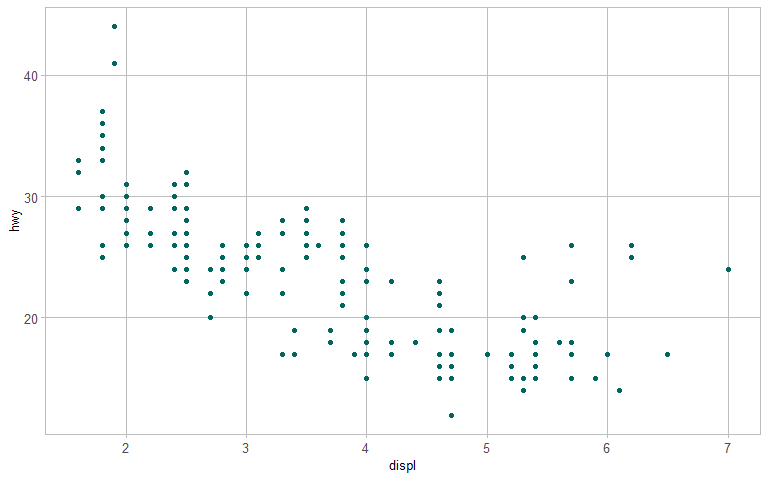

<!-- README.md is generated from README.Rmd. Please edit that file -->

# graphclassmate

## Overview

An R package with companion materials for a course in data
visualization.

The package provides data sets structured for a variety of graph types
plus a ggplot2 theme.

## Installation

Not yet available from CRAN. The development version can be installed
from GitHub.

``` r
install.packages("devtools")
devtools::install_github("graphdr/graphclassmate")
```

## Usage

`rcb()` accesses the `rcb_colors` data frame and returns a hex color
code. Thus `rcb(rcb_name)` can be substituted for any color argument.
For example

``` r
library("ggplot2")
library("graphclassmate")
ggplot(data = mpg, aes(x = displ, y = hwy)) +
  geom_point(color = rcb("dark_BG")) +
  theme_graphclass()
```



`theme_graphclass()` is a variation on `ggplot2::theme_minimal()` with
all panel and axis text set to the same font face and size and all grid
lines and panel borders set to the same line size and color. Optional
arguments allow one to edit the common font size, line size, and line
color.

Data in the package:

``` r
d <- data(package = "graphclassmate")[["results"]]
knitr::kable(d[ , c("Item", "Title")])
```

| Item        | Title                                                 |
| :---------- | :---------------------------------------------------- |
| rcb\_colors | Shorthand names for selected colors from RColorBrewer |
| speed\_ski  | Speed skiing data from GDAdata                        |

The data sets are for illustrating different graph designs, e.g., box
plots, multiways, scatterplots, dot plots, conditioning plots,
scatterplot matrices, and parallel coordinate plots. Including these
data in the package gives students quick access to data for tutorials
and exercises.

## Meta

  - Get citation information with `citation("graphclassmate")`
  - Please note that this project is released with a [Code of
    Conduct](https://github.com/graphdr/graphclassmate/blob/master/CONDUCT.md).
    If you contribute to this project you agree to abide by its terms.
